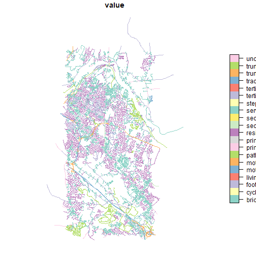
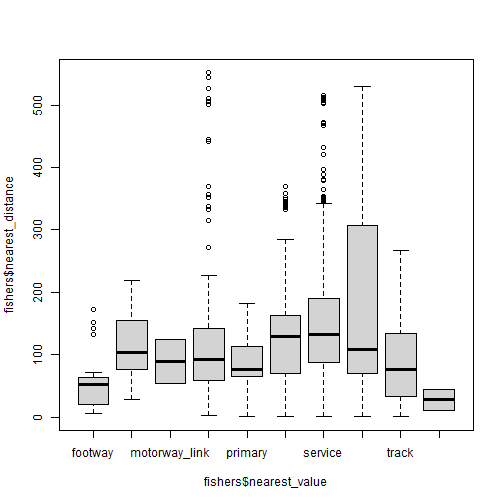

<!-- README.md is generated from README.Rmd. Please edit that file -->


# wildlifeHI

[](https://cran.r-project.org/package=wildlifeHI)

The wildlifeHI package facilitates the integration of human infrastructure data from OpenStreetMap with wildife tracking data. Specifically, it allows users to quickly and efficiently perform various types of analysis by combining wildife tracking data with OSM layers.

## Installation

You can install the latest (under development version) of wildlifeHI from github with:


```r
devtools::install_github("jedalong/wildlifeHI")
```

Currently, wildlifeHI is not yet on CRAN, but after adding some more functionality and error checks we plan to submit the package to CRAN. 

## Example

The examples use the fishers data from the \code{move} package as it is a relatively small dataset with a substantial amount of OSM data nearby.


```r
library(wildilfeHI)
#> Error in library(wildilfeHI): there is no package called 'wildilfeHI'
library(move)
data(fishers)
```

The \code{hi_get_osm} is the main function used to extract OSM data via the tracking data bounding box. The default is to get all "highway" key values, which includes things like roads, paths, and tracks.


```r
osmdata <- hi_get_osm(fishers)
head(osmdata)
#> Simple feature collection with 6 features and 3 fields
#> Geometry type: LINESTRING
#> Dimension:     XY
#> Bounding box:  xmin: -73.93883 ymin: 42.702 xmax: -73.84314 ymax: 42.76379
#> Geodetic CRS:  WGS 84
#>          osm_id     key       value                       geometry
#> 5563798 5563798 highway residential LINESTRING (-73.88344 42.76...
#> 5563818 5563818 highway residential LINESTRING (-73.92458 42.74...
#> 5563826 5563826 highway residential LINESTRING (-73.84314 42.73...
#> 5563829 5563829 highway residential LINESTRING (-73.87776 42.71...
#> 5563848 5563848 highway     service LINESTRING (-73.90772 42.70...
#> 5563881 5563881 highway     service LINESTRING (-73.93883 42.71...
```

We can also take a look at the data on the map. 


```r
### NOT RUN ###
# library(mapview)
# mapview(osmdata['value'])

plot(osmdata['value'])
```



Functionality within \code{wildlifeHI} is comprised of several types of analysis. The simplest is distance analysis which simply identifies the OSM feature nearest to each tracking fix and stores the type and distance in the output move object.


```r
fishers <- hi_distance(fishers)
boxplot(fishers$nearest_distance ~ fishers$nearest_value)
```




For much more detailed information on the package please see the documentation, I plan to release vignette in due course.

--- END --- 
