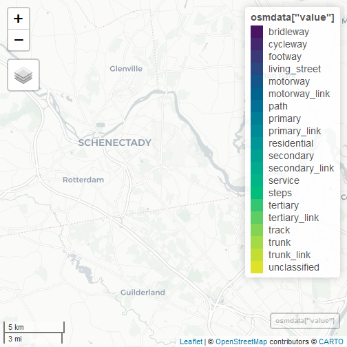

<!-- README.md is generated from README.Rmd. Please edit that file -->


# wildlifeHI

[](https://cran.r-project.org/package=wildlifeHI)

The wildlifeHI package facilitates the integration of human infrastructure data from OpenStreetMap with wildife tracking data. Specifically, it allows users to quickly and efficiently perform various types of analysis by combining wildife tracking data with OSM layers.

## Installation

You can install the latest (under development version) of wildlifeHI from github with:


```r
devtools::install_github("jedalong/wildlifeHI")
#> These packages have more recent versions available.
#> It is recommended to update all of them.
#> Which would you like to update?
#> 
#>  1: All                             
#>  2: CRAN packages only              
#>  3: None                            
#>  4: rlang  (1.1.0  -> 1.1.1 ) [CRAN]
#>  5: cachem (1.0.7  -> 1.0.8 ) [CRAN]
#>  6: sys    (3.4.1  -> 3.4.2 ) [CRAN]
#>  7: xml2   (1.3.3  -> 1.3.4 ) [CRAN]
#>  8: httr   (1.4.5  -> 1.4.6 ) [CRAN]
#>  9: wk     (0.7.2  -> 0.7.3 ) [CRAN]
#> 10: httr2  (0.2.2  -> 0.2.3 ) [CRAN]
#> 11: units  (0.8-1  -> 0.8-2 ) [CRAN]
#> 12: s2     (1.1.2  -> 1.1.4 ) [CRAN]
#> 13: sf     (1.0-12 -> 1.0-13) [CRAN]
#> 
#> rlang  (1.1.0  -> 1.1.1 ) [CRAN]
#> cachem (1.0.7  -> 1.0.8 ) [CRAN]
#> sys    (3.4.1  -> 3.4.2 ) [CRAN]
#> xml2   (1.3.3  -> 1.3.4 ) [CRAN]
#> httr   (1.4.5  -> 1.4.6 ) [CRAN]
#> wk     (0.7.2  -> 0.7.3 ) [CRAN]
#> httr2  (0.2.2  -> 0.2.3 ) [CRAN]
#> units  (0.8-1  -> 0.8-2 ) [CRAN]
#> s2     (1.1.2  -> 1.1.4 ) [CRAN]
#> sf     (1.0-12 -> 1.0-13) [CRAN]
#> package 'rlang' successfully unpacked and MD5 sums checked
#> package 'cachem' successfully unpacked and MD5 sums checked
#> package 'sys' successfully unpacked and MD5 sums checked
#> package 'xml2' successfully unpacked and MD5 sums checked
#> package 'httr' successfully unpacked and MD5 sums checked
#> package 'wk' successfully unpacked and MD5 sums checked
#> package 'httr2' successfully unpacked and MD5 sums checked
#> package 's2' successfully unpacked and MD5 sums checked
#> 
#> The downloaded binary packages are in
#> 	C:\Users\jlong83\AppData\Local\Temp\RtmpSEIK2c\downloaded_packages
#> ── R CMD build ─────────────────────────────────────────────────────────────────────────────────────────
#>   
  
  
   checking for file 'C:\Users\jlong83\AppData\Local\Temp\RtmpSEIK2c\remotes61b82c605df1\jedalong-wildlifeHI-899431d/DESCRIPTION' ...
  
✔  checking for file 'C:\Users\jlong83\AppData\Local\Temp\RtmpSEIK2c\remotes61b82c605df1\jedalong-wildlifeHI-899431d/DESCRIPTION'
#> 
  
  
  
─  preparing 'wildlifeHI':
#>    checking DESCRIPTION meta-information ...
  
   checking DESCRIPTION meta-information ... 
  
✔  checking DESCRIPTION meta-information
#> 
  
  
  
─  checking for LF line-endings in source and make files and shell scripts
#> 
  
─  checking for empty or unneeded directories
#> 
  
─  building 'wildlifeHI_0.1.0.tar.gz'
#> 
  
   
#> 
library(wildlifeHI)
```

Currently, wildlifeHI is not yet on CRAN, but after adding some more functionality and error checks we plan to submit the package to CRAN. 

## Example

The examples use the fishers data from the \code{move} package as it is a relatively small dataset with a substantial amount of OSM data nearby.


```r
library(move)
data(fishers)
```

The \code{hi_get_osm} is the main function used to extract OSM data via the tracking data bounding box. The default is to get all "highway" key values, which includes things like roads, paths, and tracks.


```r
osmdata <- hi_get_osm(fishers)

library(mapview)
mapview(osmdata['value'])
```



Functionality within \code{wildlifeHI} is comprised of several types of analysis. The simplest is distance analysis which simply identifies the OSM feature nearest to each tracking fix and stores the type and distance in the output move object.


```r
fishers <- hi_distance(fishers)
boxplot(fishers$nearest_distance ~ fishers$nearest_value)
```


For much more detailed information on the package please see the documentation, I plan to release vignette in due course.

--- END --- 
